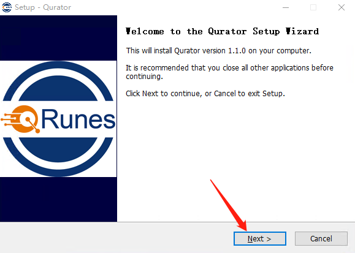
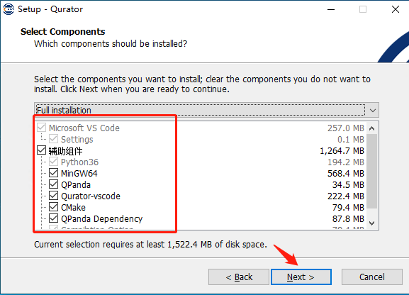
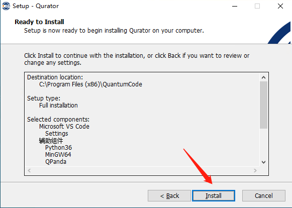

二、开始安装
==============

2.1、双击运行安装程序
------------------------

选择.exe应用程序双击运行 ,选择NEXT点击进入下一步。

2.2、选择安装目录
------------------------
可以选择系统默认的地址，或者自己选择要安装的安装路径。路径选择完成后，点击NEXT。
 
.. image::
        ../images/draw_3.jpg
        :align: center

2.3、选择安装组件
---------------------------

如果本地已有的组件，则可以不需要选择相对应的组件（注：python36组件必选）
 

需要安装的组件勾选即可，选择完成后，点击NEXT,进入下一步。

2.4、菜单文件夹创建
------------------------------

点击下一步，进入安装提示确认。

2.5、安装确认
---------------------------------

 

如图所示,在安装确认页，选择install点击进入安装

2.6安装完成
---------------------------------

安装完成后，在桌面正常生成如图Qurator应用启动快捷方式，双击该程序快捷方式，可打开程序进入使用。
 
.. image::
        ../images/draw_8.jpg
        :align: center

    
