四、新建项目并运行
================================

4.1、新建QPanda项目
---------------------------------

4.1.1、新建项目
+++++++++++++++++++++++++++++++++

启动命令行命令（ctrl+shift+p）并搜索命令QPanda:New Project
 
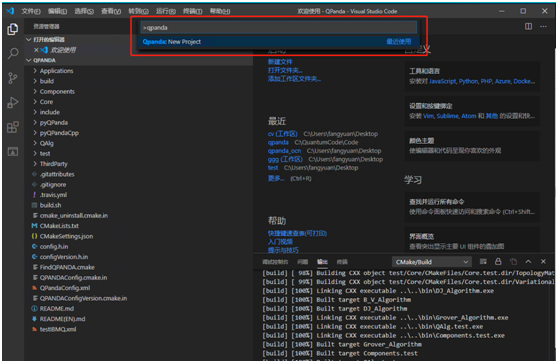

4.1.2、编辑项目名称
+++++++++++++++++++++++++++++++++

新建一个项目名（如test_qpanda）
 
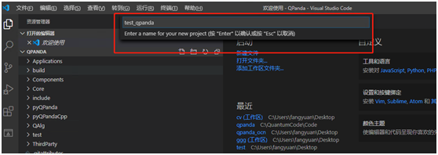

4.1.3、选择项目路径
+++++++++++++++++++++++++++++++++
 
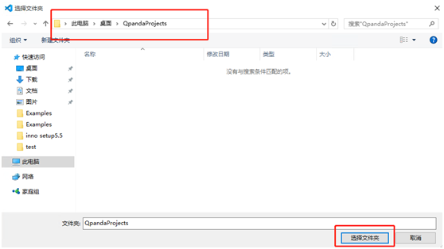

选择好项目路径就会把项目加入到vscode工作区（项目新建完成后会生成一个QPanda项目示例main.cpp和CMakeLists.txt）
 
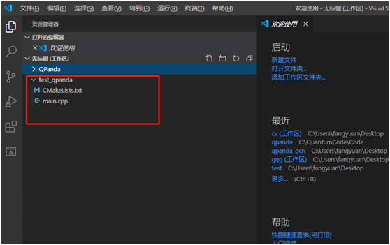

4.1.4、编译并运行示例
+++++++++++++++++++++++++++++++++

选择编译项目

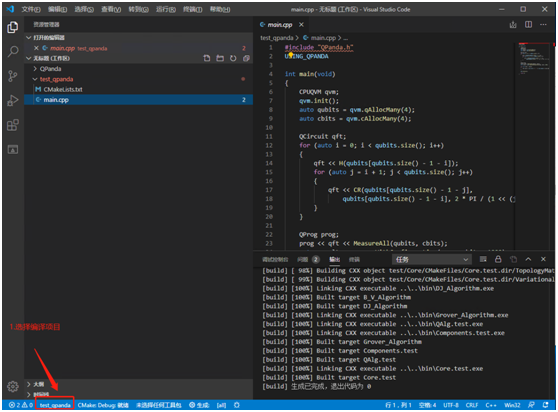

选择GCC工具包

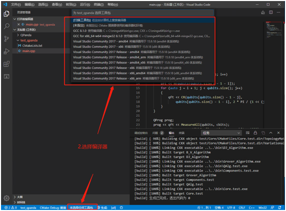

选择Cmake编译
 
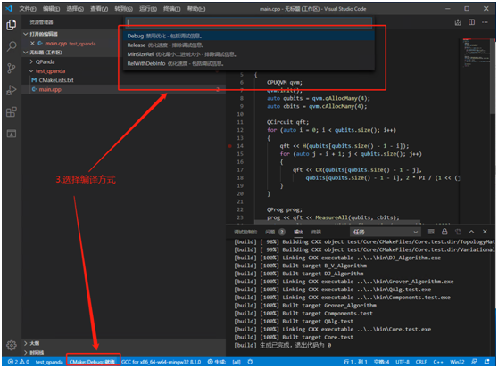

生成完成
 
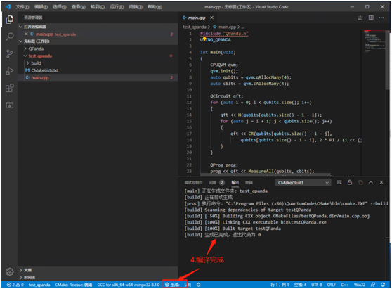

计算结果
 
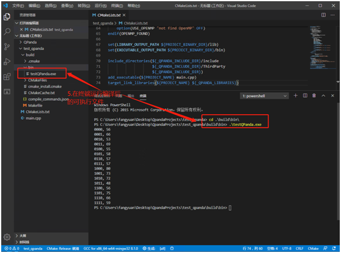

4.1.5、根据示例自己编程
+++++++++++++++++++++++++++++++++

打开CMakeLists在第2行修改项目名，项目名务必唯一；
在第73行修改运行的文件名称；
修改完成之后编译运行即可

 
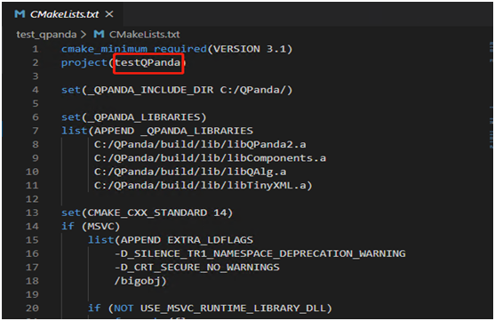

cmakeLists 修改项目名称

 
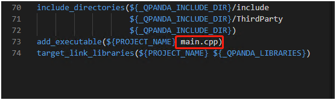

cmakeLists 修改文件名称

4.2、新建QRunes项目
--------------------------------------

4.2.1、新建项目
+++++++++++++++++++++++++++++++++

启动命令行命令（ctrl+shift+p）并搜索命令QRunes:New Project
 

Qrunes项目新建

4.2.2、 Qrunes项目名称编辑
+++++++++++++++++++++++++++++++++
 
.. image::
        ../images/draw_35.jpg
        :align: center

Qrunes项目名称编辑

4.2.3、 Qrunes项目命令行运行
+++++++++++++++++++++++++++++++++

新建test.qrunes,编写测试代码，通过命令行qrunes -f 加执行qrunes文件输出运行结果 
 
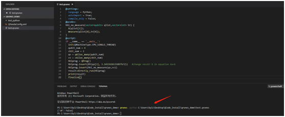

命令行运行

4.2.4、 Run this Qrunes按钮运行
+++++++++++++++++++++++++++++++++

如图所示，Qrunes文件可以通过右上角Run this Qrunes按钮进行运行。运行结果会以图表形式进行展示。
 
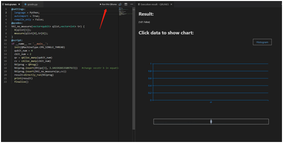

run this qrunes按钮运行

4.2.5、实现源程序到OriginIR文件生成
++++++++++++++++++++++++++++++++++++++++

终端执行qrunes -h查看帮助命令

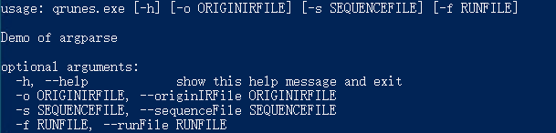

执行qrunes -o 加qrunes文件执行生成OringinIR文件
 
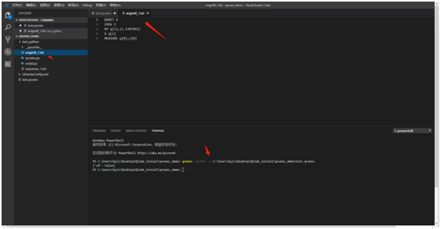

转化OriginIR

4.2.6、 实现IR的分时序操作
+++++++++++++++++++++++++++++++++

执行qrunes -s 加qrunes文件执行生成sequence文件
 
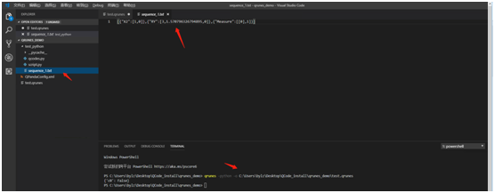

实现IR分时序操作
